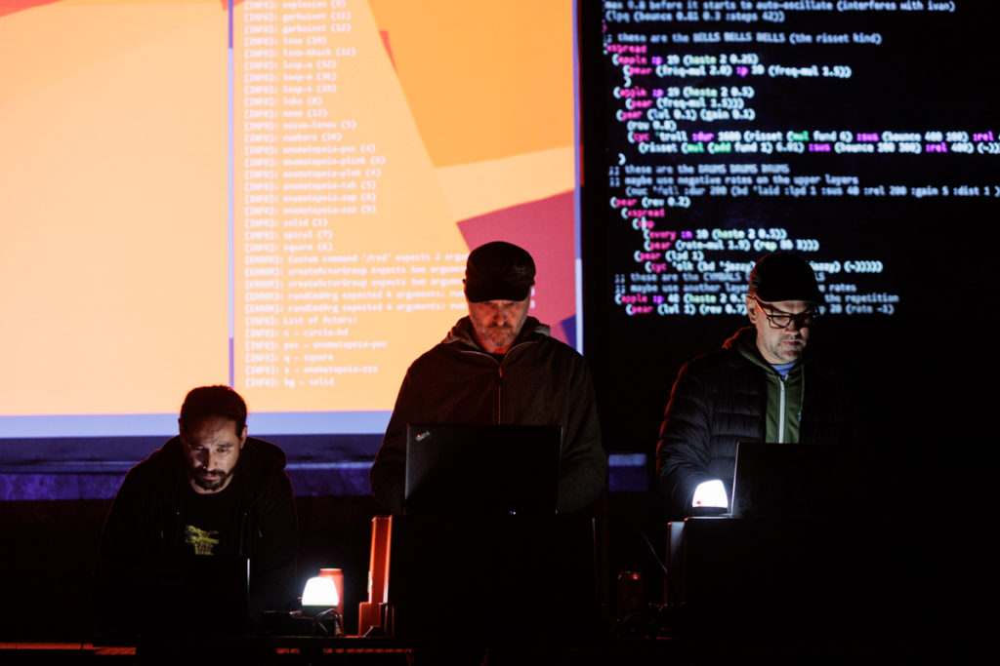

# Barcelonski supertrio

The "Barcelonski supertrio" is an audiovisual experience created by veteran electronic musicians and visualists Iván Paz, Roger Pibernat and Niklas Reppel.
Based in Barcelona, the project was formed in Slovenia on the occasion of a concert at Kluže Fortress in 2023 (see here: [https://pif.camp/piftopia-from-krn-to-kluze-pifwednesday-2/](https://pif.camp/piftopia-from-krn-to-kluze-pifwednesday-2/)). 

Their electronic music integrates elements of post-rock, drone, and ambient, and with the tight integration of the visuals, reminds of 
bands and projects such as Boards of Canada or GY!BE, yet has a very distinct quality due to the way it is created.

All music and visuals are created algorithmically, through the modification of source code live on stage (see: [https://en.wikipedia.org/wiki/Live_coding](https://en.wikipedia.org/wiki/Live_coding)). The code is projected behind the 
performers and lets the audience take a glimpse into the creation process, creating a feeling of live-ness that is otherwise rarely found in 
electronic music.

The music works best when played inside massive walls, but without a roof, like old castles, factories, or other abandoned spaces.

Photo: Katja Goljat, Matjaž Rušt

[VIDEO LINK]

# Technical Requirements 

## Stage Layout

Projectors should ideally be hanging from above, so they don't shine into the performer's faces, but compromises can be made, depending on the location.

## Required Material

- Projectors with HDMI inputs.
  - Ideally three projectors, one for each performer. 
  - Alternatively, one projector and a video mixer.
  - The code of every performer should be visible.
- A large screen behind the performers, or three screens, one for each performer.
  - Might just be the wall.   
- A reasonably powerful PA (audience should be able to feel the sound).
- If the main speakers are in front of the performers, we'll need monitor speakers.
- Two stereo DI inputs, one for Iván, one for Niklas.
- A large table for 3 Laptops (see layout).
  - Alternatively, three individual tables.
